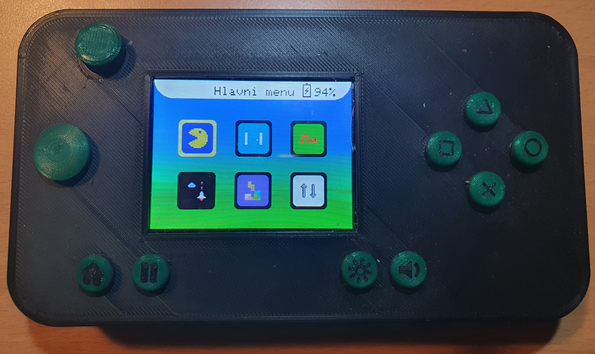
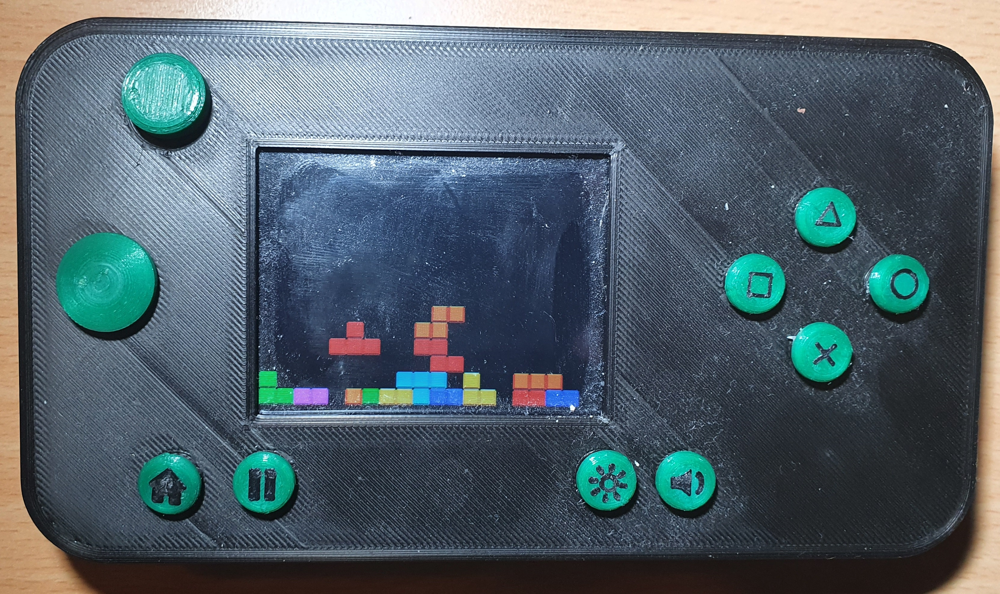

# Konzole
Herní konzole s Atmega328 vytvořená v rámci kroužku v DDM Praha 6.

##### Hardware
- TFT display 320x240
- Custom joystick
- 8 tlačítek
- IR vysílač a přijímač
- Otočný potenciometr
- Nabíjecí li-ion baterie s nabíjecím obvodem na micro USB

##### Software
Implementovány byly hry:
 Pong, Tetris, Snake (credits: Vojtěch Černý), pacman, Space shooter

##### Obrázky

